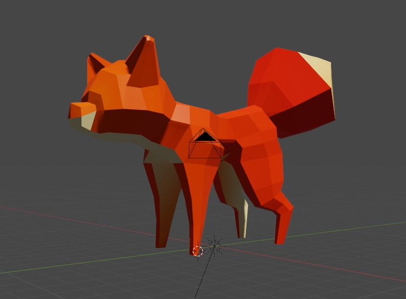

# Jérémy Provost

j'ai complété une partie de la première zone de terrain qui est considéré comme le paysage de l'été. Par la suite on va intégrer la ville et la zone pollution dans la même scène avec des animations. J'ai texturé le sol et les montagnes inclus.

# Vincent Lachapelle
Cette semaine, j'ai continué d'entretenir les médias sociaux. De plus, j'ai fait des tests dans unity et dans Blender pour assurer le bon fonctionnement du projet. J'ai eu plusieurs bug dans ces tests, mais ils sont réglés. Malheureusement, j'avais aussi pris du temps à commencer un terrain sur Unity, mais il ne nous servira pas car nous avons changé de méthode en utilisant Blender.

# Rosalie Blanchet
Cette semaine, j'ai tester avec vincent l'intégration de nos modèle dans unity, pour s'assurer de la bonne importation de nos animation. J'ai également texturé dans blender (contrairement à la sedmaine passé où nous les texturions dans unity) tous mes assets d'été en plus de les importés en fbx pour que Jérémy puisse les utilisés. De plus j'ai terminer la modélisation d'un renard qui sera animé à travers les changements de scènes. 

# Pierre-Carl Gagnon
Cette semaine j'ai programmer les changement de scene avec les joycon et aussi régler plusieur bug avec la compatibilité de la librairie et bug lfs git hub mais maintenant tout fonctionne alors c'est parfait
