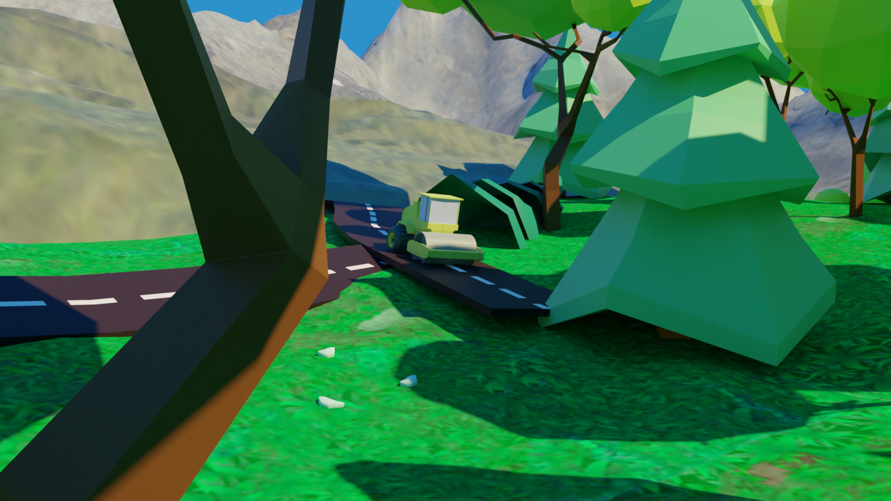
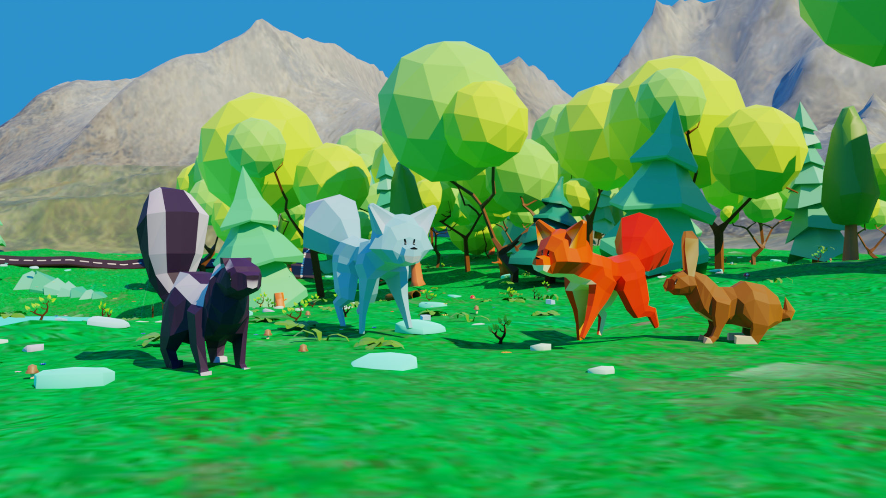
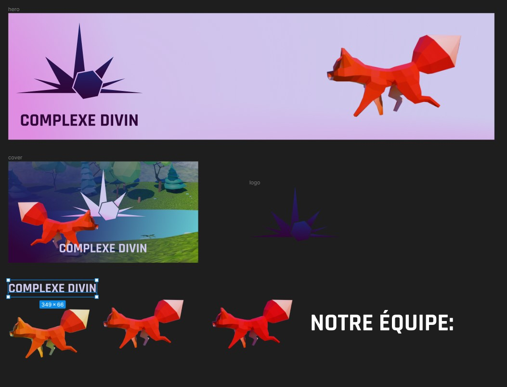
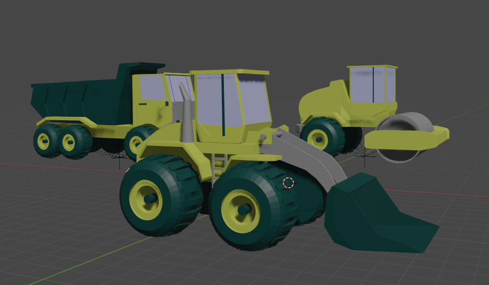
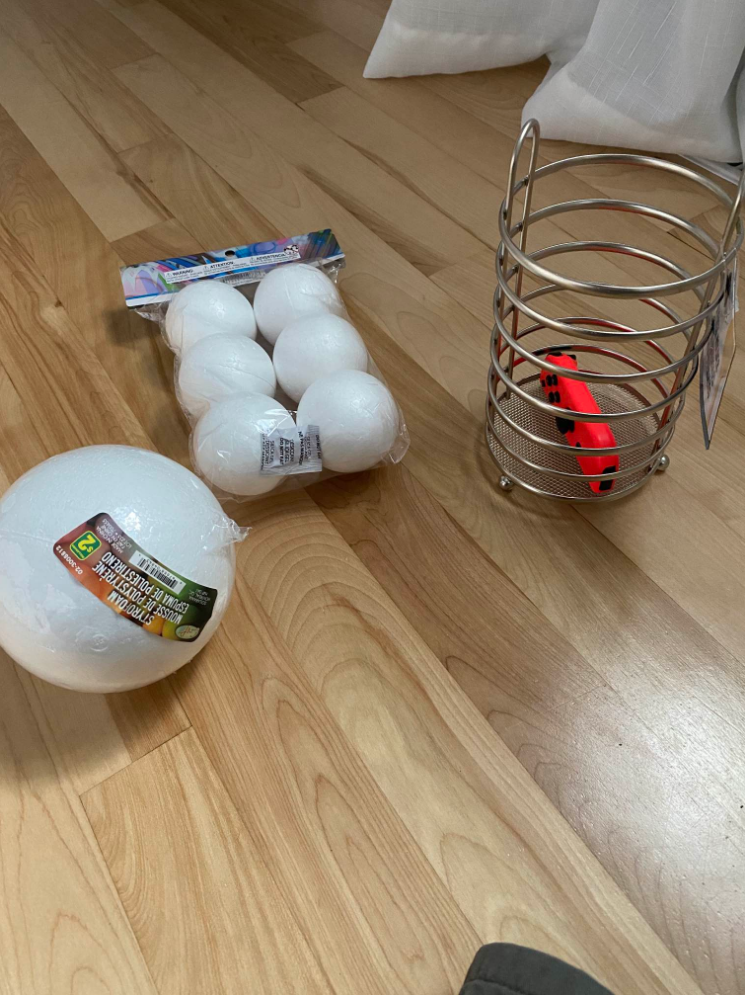
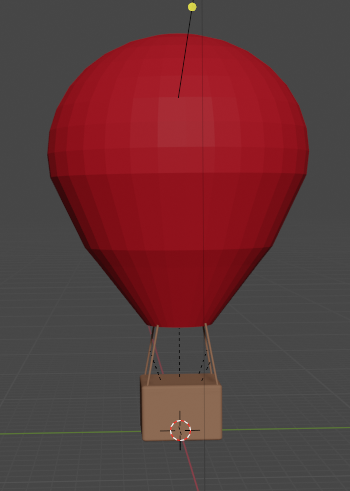
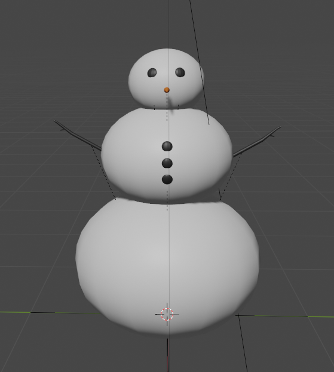
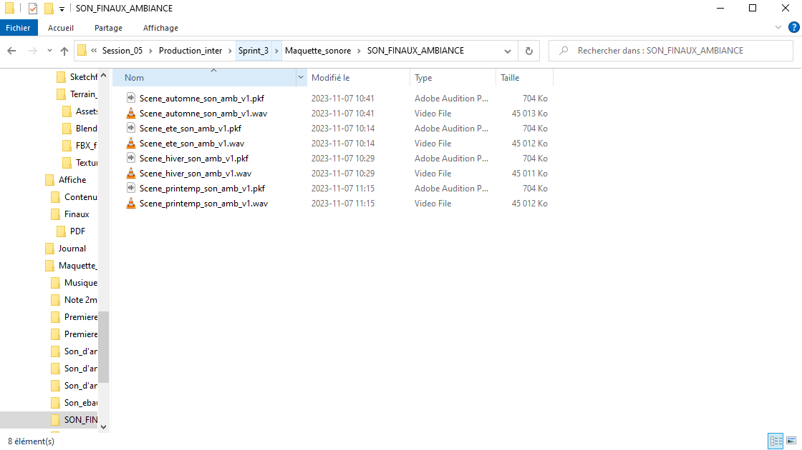
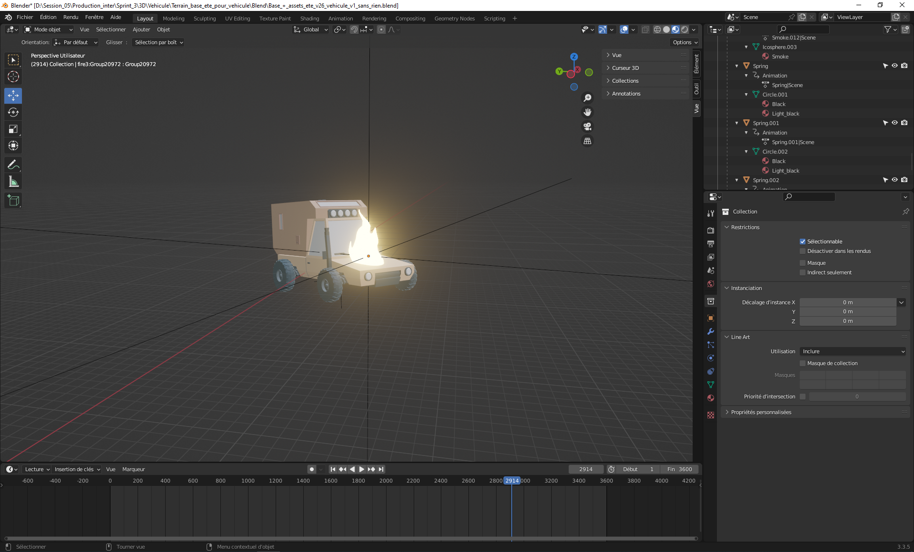

# Rosalie Blanchet
Cette semaine, j'ai commencer l'animation des transitions paysage, ville et pollution de la scène d'été en plus d'avoir fait la modélisation des personnages qui vont être animé en même temps dans nos 4 scènes de saisons.

Pour finir, j'ai amorcée les thumbnails qui vont être intégré au site choas média.

# Vincent Lachapelle
Cette semaine, j'ai continué de faire des assets pour le projet et je suis également allé magasiné pour du matériel utile au projet. J'ai également publié sur nos réseaux sociaux pour montrer l'avancement du projet.
J'ai prit ces camions sur Unity asset store et j'ai ajouté de la couleur. J'ai aussi fait des tests pour m'assurer que le matériel suive le fbx dans Unity, même s'il sagit d'une image de texture.

J'ai acheté des boules pour le soleil et la terre ainsi qu'une base en métal que j'ai également coupée. Je me suis également procuré une plaque tournante pour le projet.

J'ai également modélisé plus d'assets pour le projet comme une montgolfière, un bonhomme de neige, des cônes oranges etc.

Finalement, j'ai fait des tests avec les projecteurs en classe pour m'assurer qu'on est capable d'avoir plusieurs caméra en même temps et ça marche!

# Jérémy Provost
Cette semaine, j'ai commencé par la finition du son pour chacune des saisons. Sur une durée de 3600 frames qui équivaut à 2 minutes. Ça n'a pas été long.

Ensuite j'ai animé le véhicule du moment vil à être. Les assets sont libres de droits. Le feu doit ensuite apparaitre pour démontrer la dégradation.

Pour finir, j'ai terminé l'affiche du projet pour la présentation du 29 novembre. Le prof a approuvé donc je vais bientôt l'envoyer pour l'impression.

