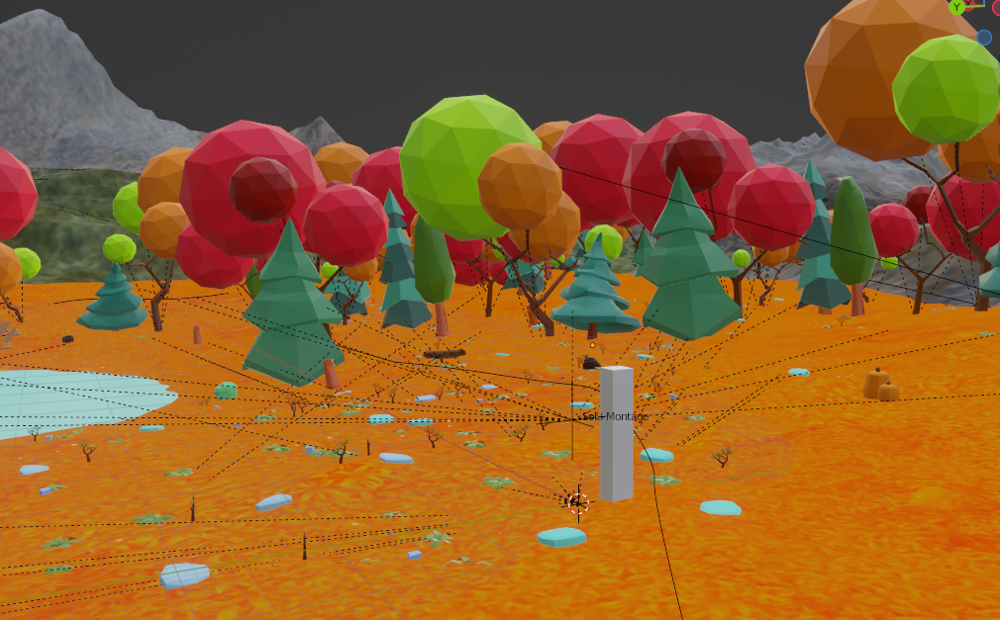
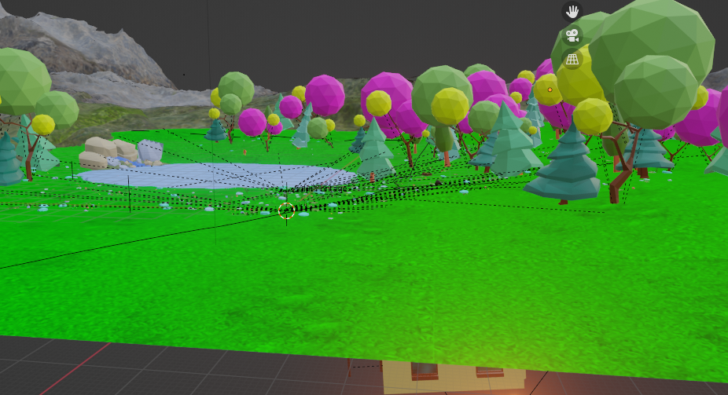

## Consignes

Votre journal doit inclure un résumé de la semaine, vos bon coups et réussites, les difficultés et défis, ainsi que les tâches effectuées.

Vous devez inclure des images, liens et autre contenu nécéssaire pour supporter vos explications et montrer l'avancement du projet.

# Vincent Lachapelle
Cette semaine, j'ai finaliser la modélisation d'assets à intégrer dans les scènes, j'ai créer des rushs pour la vidéo du sprint 3 et j'ai continué d'alimenter nos réseaux sociaux. De plus, j'ai modifié une copie de la scène d'été pour faire la scène d'automne et la scène de printemps.

# Pierre-Carl Gagnon
Cette semaine, j'ai finaliser les changement de scene pour que on est la meme frame d'animation de scene a autre, j'ai programmer le bouton qui fais jour ou nuit lorsque on click sur la planete terre la nuit vas tomber et si on reclique le soleil se leve.

# Jérémy Provost

