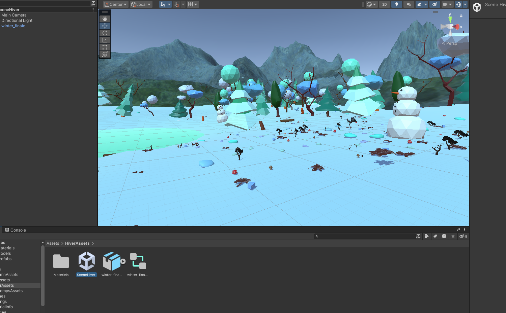

## Consignes

Votre journal doit inclure un résumé de la semaine, vos bon coups et réussites, les difficultés et défis, ainsi que les tâches effectuées.

Vous devez inclure des images, liens et autre contenu nécéssaire pour supporter vos explications et montrer l'avancement du projet.

# Vincent Lachapelle
Cette semaine, j'ai finaliser la modélisation d'assets à intégrer dans les scènes, j'ai créer des rushs pour la vidéo du sprint 3 et j'ai continué d'alimenter nos réseaux sociaux. De plus, j'ai modifié une copie de la scène d'été pour faire la scène d'automne et la scène de printemps.

# Pierre-Carl Gagnon
Cette semaine, j'ai finaliser les changement de scene pour que on est la meme frame d'animation de scene a autre, j'ai programmer le bouton qui fais jour ou nuit lorsque on click sur la planete terre la nuit vas tomber et si on reclique le soleil se leve.

# Jérémy Provost
Cette semaine, j'ai commencé par la création de l'affiche réel qui sera présenté pendant le ChaosMedia, je l'ai ensuite imprimé

Ensuite, j'ai réalisé deux vidéos capsules de 30 secondes, avec la même ambiance et couleur du projet

Sur le projet, j'ai complété l'animation de la base du projet, avec les parties paysages, villes et pollutions.

Pour finalement, j'ai complété la scène printemp avec quelque modification

# Rosalie Blanchet 
Cette semaine, j'ai finalisé les deux thumbnail pour les mettres sur le site chaos media 

J'ai compléter la scène d'hiver. Ensuite j'ai modifier toutes les scenes pour qu'on puisse les importer dans unity et j'ai linker les textures pour qu'ils soient fonctionnels dans la scène.

