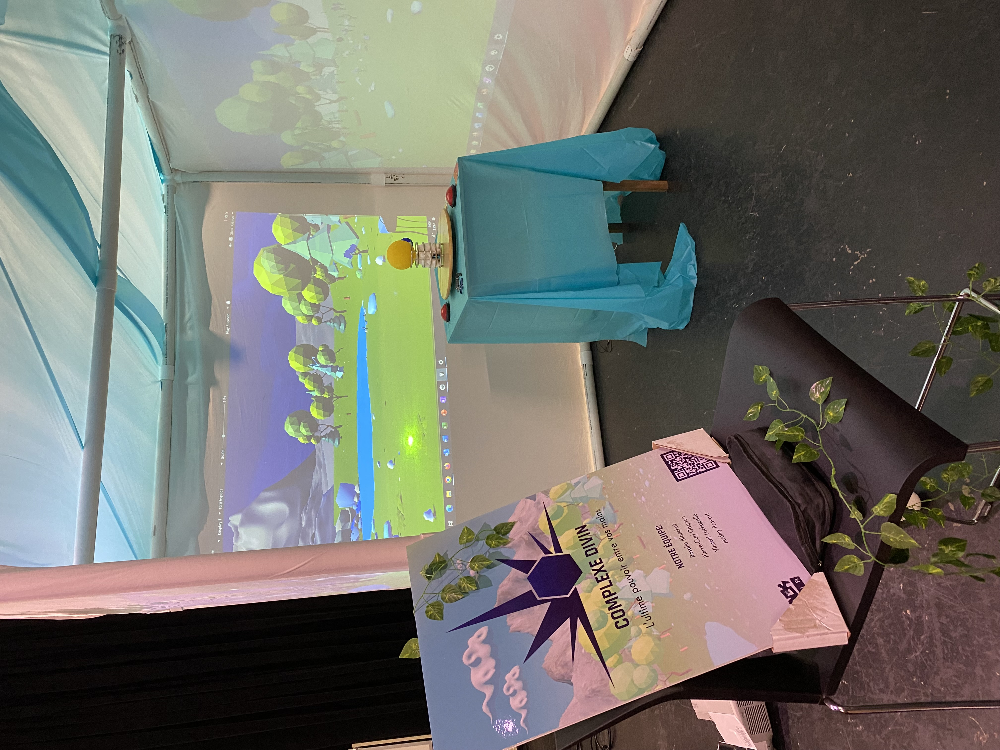
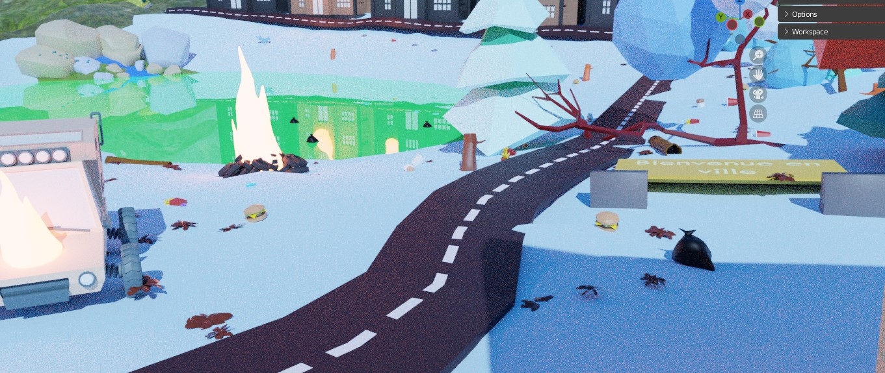
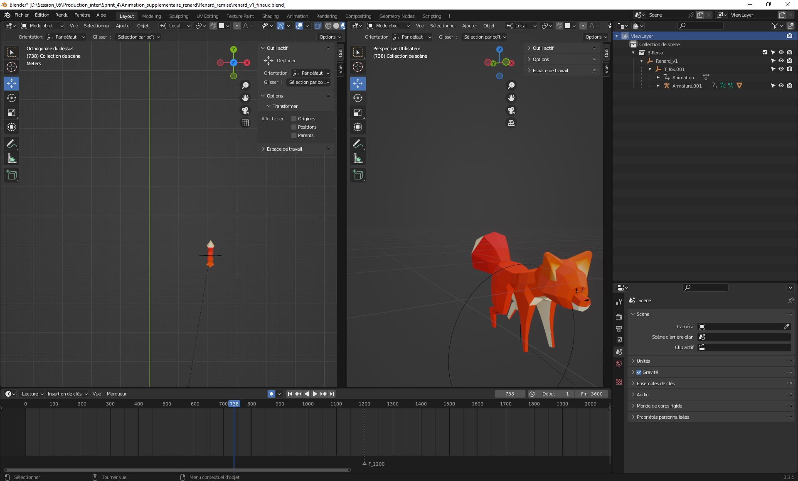

## Consignes

Votre journal doit inclure un résumé de la semaine, vos bon coups et réussites, les difficultés et défis, ainsi que les tâches effectuées.

Vous devez inclure des images, liens et autre contenu nécéssaire pour supporter vos explications et montrer l'avancement du projet.

# Vincent Lachapelle
Cette semaine, j'ai peinturer les planètes avec de multiples couches de peintures pour que les couleurs soient belle. Je suis aussi allé acheter des choses importantes au Dollorama et au Rona. J'ai continué d'alimenter les réseaux sociaux. 
J'ai testé les projecteurs que nous avons utilisés pour la générale, cependant, nous nous enlignons maintenant sur de la réalité virtuelle pour le projet. Il y avait aussi la générale de Chaos Média. Nous avons donc testé en équipe le projet pour soulever les points positifs et négatifs.

# Rosalie Blanchet
Cette semaine j'ai terminer l'animation des 4 animaux qui bougent, j'ai crée les textures qui allais etre utilisé pour les systèmes de particules. J'ai également ajouté des modèles 3D et des animations pour remplire la scène de polution.

# Jérémy Provost
Pour commencer cette semaine, j'ai conclu la capsule vidéo du sprint 2 et 3.

Ensuite, pour créer une plus grande variété d'animation, j'ai créer d'autre animation de renard qui ce promaine dans la scène.

