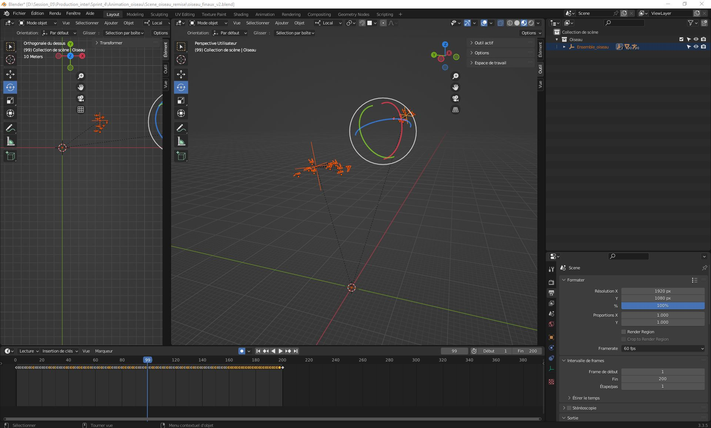

## Consignes

Votre journal doit inclure un résumé de la semaine, vos bon coups et réussites, les difficultés et défis, ainsi que les tâches effectuées.

Vous devez inclure des images, liens et autre contenu nécéssaire pour supporter vos explications et montrer l'avancement du projet.

# Vincent Lachapelle
Cette semaine, j'ai fait la 4eme partie de la scène pour adapater la scène en réalité virtuelle. J'ai ajouté des collines, du reliefs et des éoliennes. J'ai testé l'adaptation du projet en vr pour trouver des choses qui ne fonctionnent pour l'améliorer. De plus, j'ai fais le script pour l'effet des oiseaux et pour redémarrer la scène lorsqu'on le souhaite, en plus de trouver un moyen de redémarrer la scène automatiquement. Finalement, j'ai publié sur nos réseaux sociaux pour les garder actifs.

# Rosalie Blanchet
Nous avons migré vers la vr. Alors pour que les utilisateur puissent encore intéragire avec la table dans la vrai vie, j'ai crée un nouveau model 3D de la table à l'échelle. De plus j'ai crées des nouveau modéle de papillons et une animation pour que le début de notre scène soit un peu plus vivant. J'ai egalement remis les textures dans les scene unity.

# Jérémy Provost
Pour remplacer l'animation des particules, on à intégré une animation d'oiseau avec des assets de Sketchfab.

Pour engendré plus de variété, j'ai changé des assets des renards que j'ai fait la semaine passé pour une moufette et un lapin, des assets créer par Rosalie.

