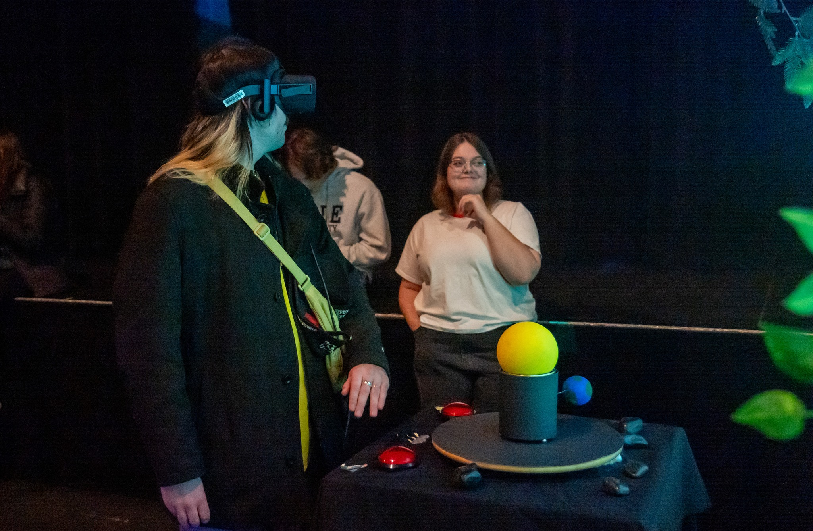

# Rosalie Blanchet
Avant l'évenement, j'ai aidé mes cooéquipiers à monter la structure. J'ai également fait les derniers ajustement dans la scène unity avant de presenter notre projet. On a changer le modele de la table, changer les lumières et changer les systèmes de particules car il y avait quelques bogue. Durant l'évenement, j'ai passer beaucoup de temps à accueillir les utilisateurs et à les insister à voté pour nous : ) On a aussi du fixer un petit bogue au début de la soirée. Ensuite jai aidé à démonté la structure.

