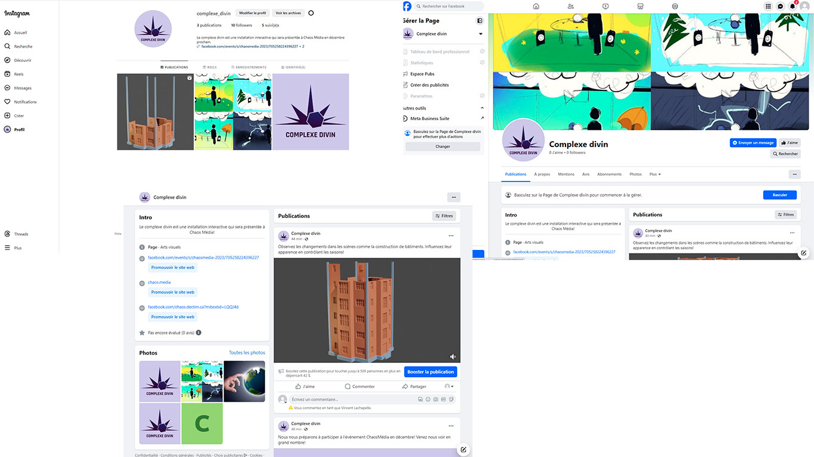

## Consignes

Votre journal doit inclure un résumé de la semaine, vos bon coups et réussites, les difficultés et défis, ainsi que les tâches effectuées.

Vous devez inclure des images, liens et autre contenu nécéssaire pour supporter vos explications et montrer l'avancement du projet.

# Jérémy Provost

J'ai commencé à faire la base du fichier Premiere avec les captures du sprint 1 et des rushs de mes coéquipiers.

# Rosalie Blanchet

J'ai commencé la modélisation des éléments de la scène d'automne. En les créant, je m'assure qu'ils soient facilement réutilisables pour d'autres saisons, de sorte qu'une fois l'automne terminé, les autres saisons soient plus rapides à réaliser. J'ai également testé certains morceaux de code, tels que le compteur d'ouverture de scène et le changement de textures. Cependant, avec les changements que nous avons apportés à notre projet, ces morceaux de code ne seront pas utilisés.

# Vincent Lachapelle

Pour cette semaine, je me suis concentré sur la création des réseaux sociaux pour promouvoir le projet. Je me suis assuré qu'ils soient conforment aux consignes et j'ai également publier des images.
Facebook: https://www.facebook.com/profile.php?id=61552287817167
Instagram: https://www.instagram.com/complexe_divin/?next=%2F
