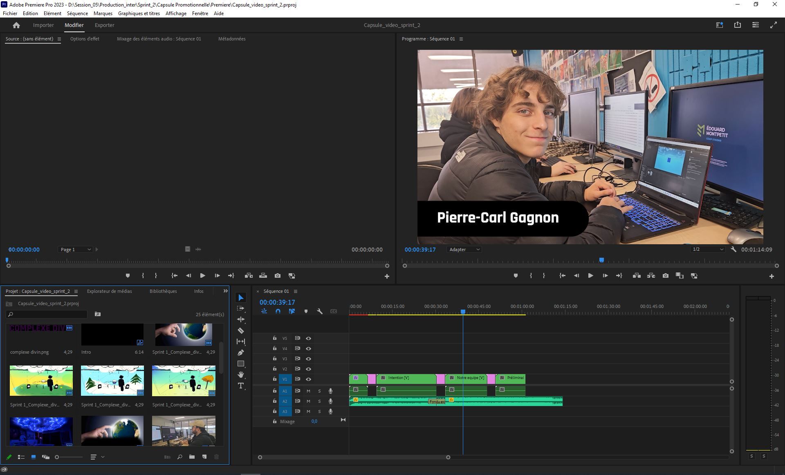
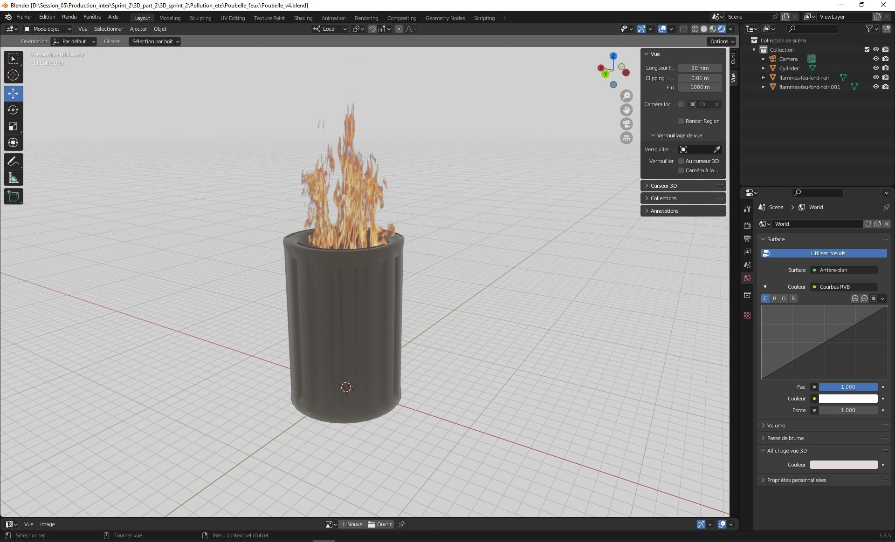

## Consignes

Votre journal doit inclure un résumé de la semaine, vos bon coups et réussites, les difficultés et défis, ainsi que les tâches effectuées.

Vous devez inclure des images, liens et autre contenu nécéssaire pour supporter vos explications et montrer l'avancement du projet.

# Jérémy Provost

j'ai complété le montage de la capsule vidéo. Il me manque juste la démonstration préliminaire à intégrer. Je me suis grandement inspiré des textes de présentation des jeux Zelda.

J'ai commencé la modélisation des assets de la zone de pollution.
