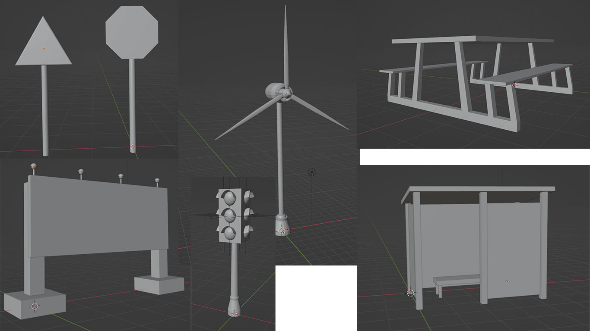
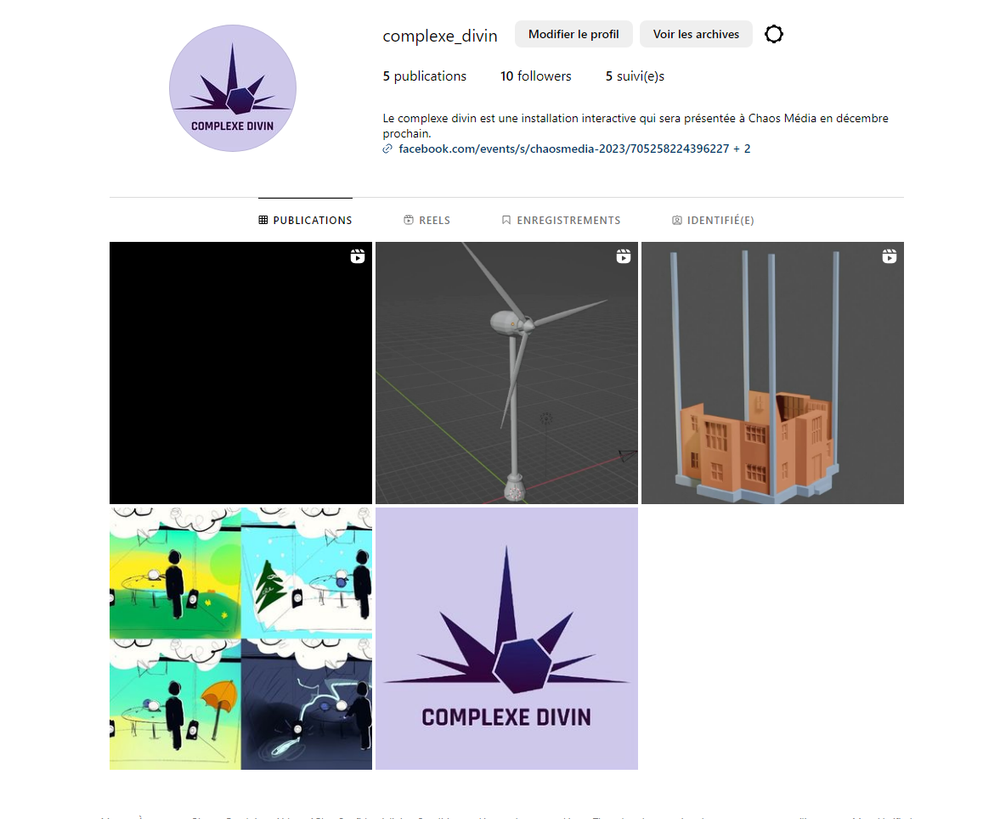
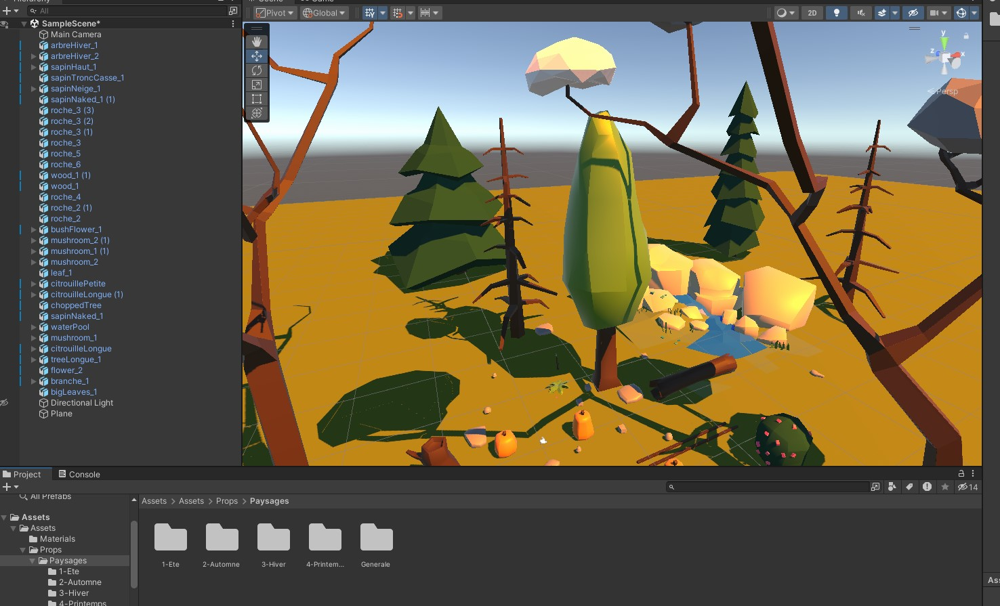

## Consignes

Votre journal doit inclure un résumé de la semaine, vos bon coups et réussites, les difficultés et défis, ainsi que les tâches effectuées.

Vous devez inclure des images, liens et autre contenu nécéssaire pour supporter vos explications et montrer l'avancement du projet.

# Jérémy Provost

j'ai complété le montage de la capsule vidéo. Il me manque juste la démonstration préliminaire à intégrer. Je me suis grandement inspiré des textes de présentation des jeux Zelda.

J'ai commencé la modélisation des assets de la zone de pollution.

# Vincent Lachapelle
Cette semaine, j'ai modélisé des assets en 3D qui seront intégrés dans les scènes. Mes assets se concentrent ur l'aspect urbain du projet. Par exemple, j'ai fait des panneaux de circulation, un arrêt de bus, un éolienne, et plus. Voici quelques photos.

De plus, j'ai continué d'alimenter les réseaux sociaux avec des images de notre projet!

# Rosalie Blanchet

Vers la fin de la semaine, j'ai également commencé à intégrer les modèles de Blender dans Unity pour m'assurer que tout était compatible.
